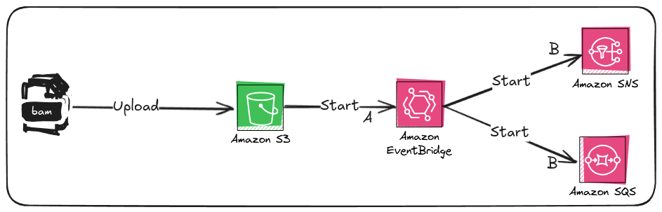

# AWS S3 Event Notification with EventBridge, SNS, and SQS

This Terraform configuration sets up an AWS S3 bucket to trigger an EventBridge event on object uploads. The EventBridge rule then forwards the event to two targets: an SNS topic and an SQS queue. Each target only receives relevant S3 event details, thanks to an input transformer that formats the message payload as the first message (A)



## Components

1. **S3 Bucket**:
    - An S3 bucket is created to store uploaded files.
    - Configured to send "Object Created" events (file uploads) to EventBridge.

2. **EventBridge Bus and Rule**:
    - A custom EventBridge event bus is created to route the S3 bucket events.
    - The EventBridge rule filters for "Object Created" events from the S3 bucket and directs them to both the SNS and SQS targets.

3. **SNS Topic and SQS Queue**:
    - **SNS Topic**: Receives the filtered S3 event message, which includes details about the uploaded object (e.g., bucket name, object key, and requester).
    - **SQS Queue**: Similarly receives the event details, allowing processing by queue-based services.
   -  Both targets use an `input` to extract and format the message, removing extra metadata and focusing only on essential event details.

## Message Transformation

The `input` in `eventbridge.tf` extracts specific fields from the event's `detail` payload, removing unwanted metadata. This results in a simplified message containing only relevant S3 object information, structured as follows:

```json
{
   "version": "0",
   "bucket": {
      "name": "bucket-upload-events-test"
   },
   "object": {
      "key": "image.jpeg",
      "size": 89443,
      "etag": "4c6666286b6c46",
      "sequencer": "000000000000000000"
   },
   "request-id": "8ZJZZZZZZZZZZZZZ",
   "requester": "44444444444",
   "source-ip-address": "1.1.1.1",
   "reason": "PutObject"
}
```

